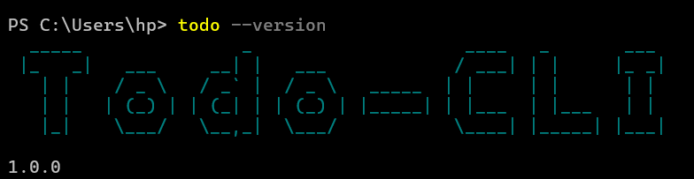
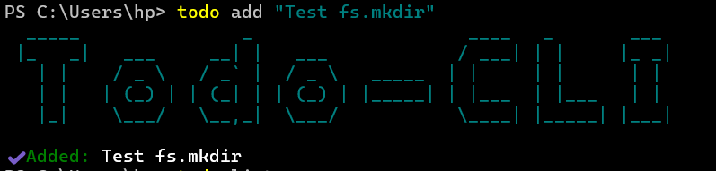
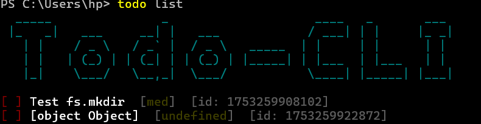
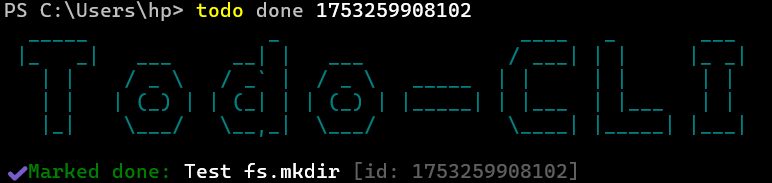
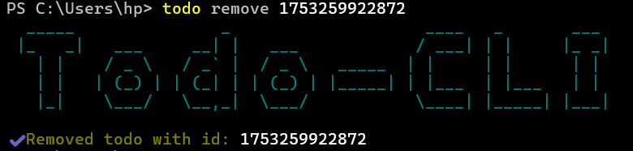

```markdown
# 📋 Todo-CLI

A polished, filesystem-based command-line Todo list built with Node.js and [Commander](https://www.npmjs.com/package/commander).  
Manage your tasks right from the terminal—with colors, ASCII art, and an interactive mode.

---

## 🚀 Features

- **Add**, **list**, **mark done**, and **remove** todos  
- Store data in `~/.todo-cli/todos.json`  
- Colored output via [chalk](https://www.npmjs.com/package/chalk)  
- ASCII-art banner via [figlet](https://www.npmjs.com/package/figlet)  
- Optional due-dates, priorities, and tags  
- Interactive prompt mode when run without arguments  
- Cross-platform (Windows PowerShell, macOS/Linux shell)

---

## 📁 Repository Layout

 

todo-cli/
├── bin/
│   └── todo                # CLI entrypoint (executable)
├── commands/
│   ├── add.js              # `todo add`
│   ├── list.js             # `todo list`
│   ├── done.js             # `todo done`
│   ├── remove.js           # `todo remove`
│   └── interactive.js      # interactive mode
├── lib/
│   ├── storage.js          # JSON load/save + migrations
│   └── tasks.js            # core CRUD logic
├── screenshots/            # example usage screenshots
├── test/                   # Jest unit tests
├── .github/                # CI workflows
├── .gitignore
├── LICENSE
├── package.json
└── README.md

 

---

## ⚙️ Installation

```bash
# Clone this repo
git clone https://github.com/<your-user>/todo-cli.git
cd todo-cli

# Install dependencies
npm install

# Link for local development (or install globally)
npm link
# → now `todo` is on your PATH
````

---

## 🎬 Usage

### Version

```bash
todo --version
```



### Add a Todo

```bash
todo add "Buy groceries" --due 2025-08-01 --priority high --tag shopping errand
```



### List Todos

```bash
todo list
todo list --status pending
todo list --tag shopping
```



### Mark Done

```bash
todo done <id>
```



### Remove

```bash
todo remove <id>
```



### Interactive Mode

Simply run without arguments:

```bash
todo
```

Then follow the on-screen prompts to add, list, complete, or delete tasks.

---

## 🤝 Contributing

1. Fork the repository
2. Create a feature branch (`git checkout -b feat/your-feature`)
3. Commit your changes (`git commit -m "feat: describe feature"`)
4. Push to the branch (`git push origin feat/your-feature`)
5. Open a Pull Request

Please run `npm test` and `npm run lint` before submitting.

---

## 📄 License

This project is licensed under the [MIT License](LICENSE).

---

> Built with ❤️ by RajPawar27(https://github.com/RajPawar27)

```
::contentReference[oaicite:0]{index=0}
```
